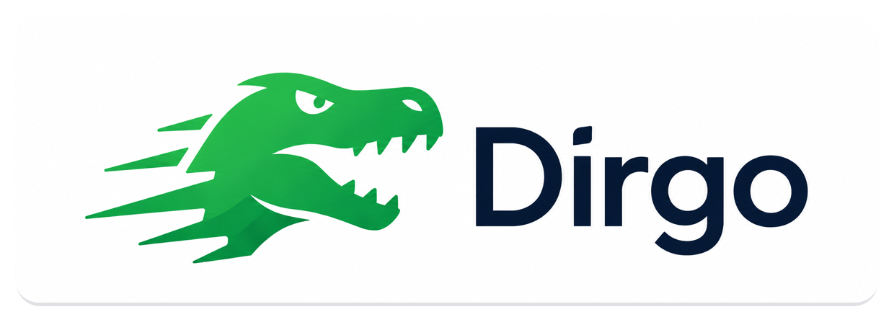
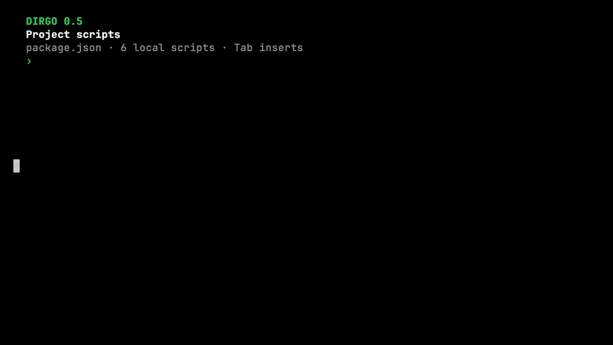
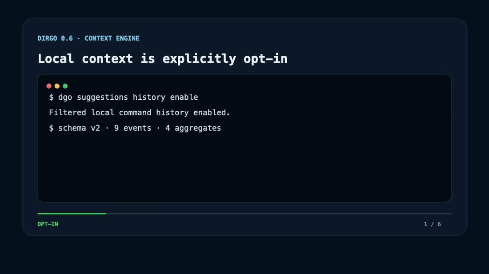
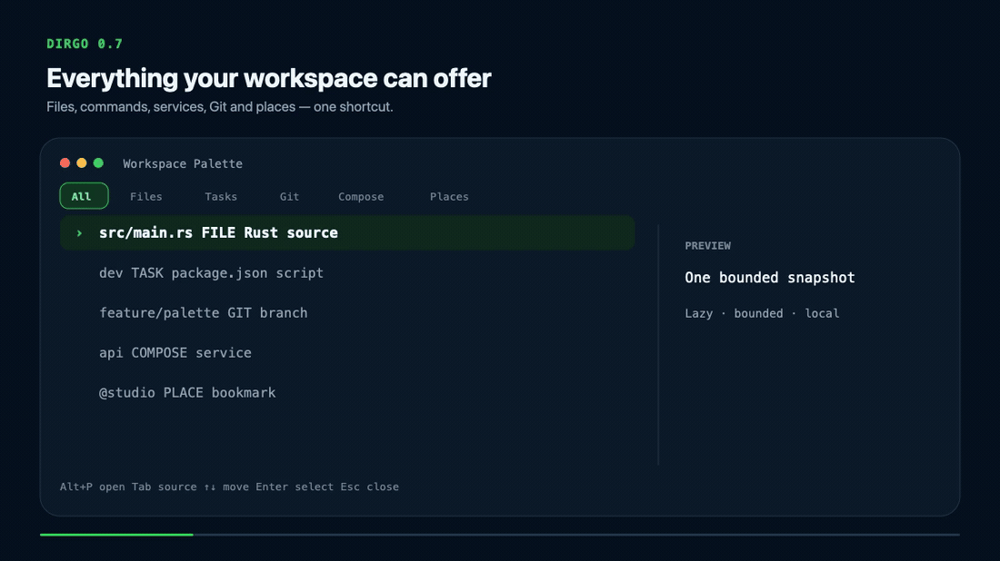
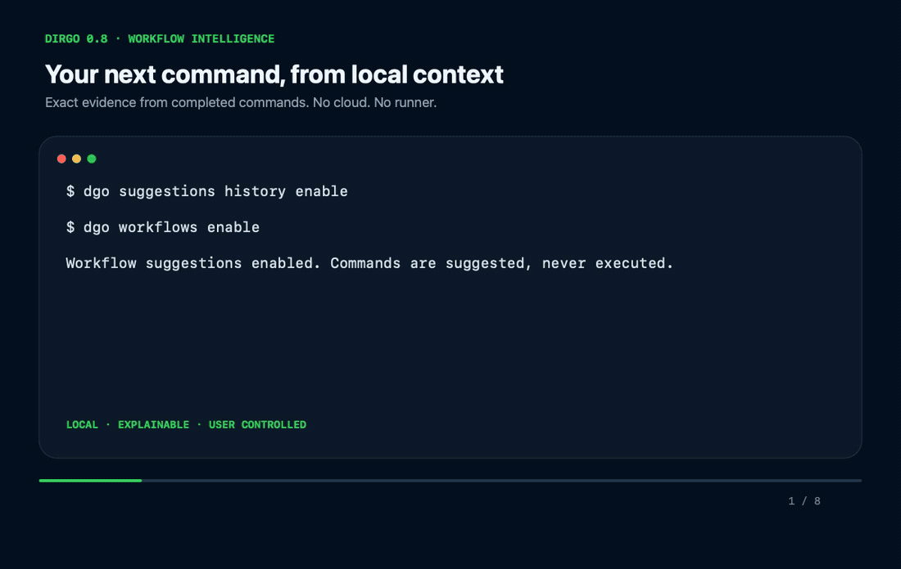
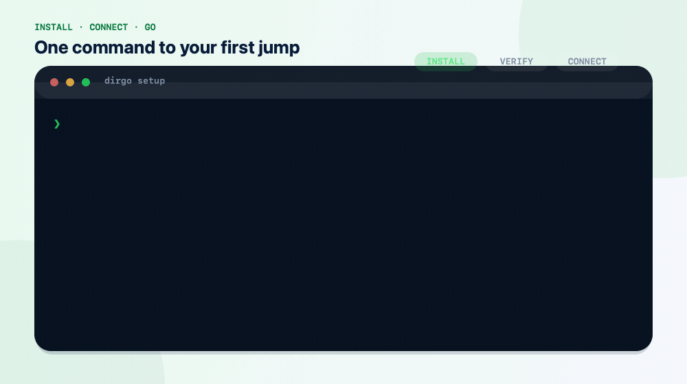

<div align="center">



<table width="100%">
  <tr>
    <td align="center">
      <strong>💚 Support Dirgo</strong><br>
      If Dirgo saves you time, <a href="https://github.com/RudySource/Dirgo">star it on GitHub</a>,
      <a href="https://github.com/RudySource/Dirgo/issues/new/choose">share feedback</a>, or
      <a href="CONTRIBUTING.md">contribute a fix</a>.<br><br>
      <a href="#support-dirgo"><strong>Support development with BTC or USDT TRC20 →</strong></a>
    </td>
  </tr>
</table>

<h1>Dirgo</h1>

<p><strong>Go anywhere. Instantly.</strong></p>

<p>A fast, local-first directory navigator and command companion for the terminal.</p>

<p>
  <a href="https://github.com/RudySource/Dirgo/actions/workflows/ci.yml"></a>
  <a href="https://github.com/RudySource/Dirgo/releases/latest"></a>
  <a href="https://github.com/RudySource/Dirgo/releases"></a>
  <a href="https://www.rust-lang.org"></a>
  <a href="LICENSE-MIT"></a>
</p>

<p>
  <a href="#install">Install</a> ·
  <a href="#quick-start">Quick start</a> ·
  <a href="#interactive-picker">Picker</a> ·
  <a href="#commands">Commands</a> ·
  <a href="#configuration">Configuration</a> ·
  <a href="#support-dirgo">Support</a> ·
  <a href="#privacy-and-security">Security</a> ·
  <a href="#release-status-and-roadmap">Roadmap</a>
</p>

</div>

Dirgo indexes your filesystem, finds directories you have never visited, and
uses local history to improve ranking over time.

| ⚡ **55 ms** | 🗂️ **1M directories** | 🔒 **Zero telemetry** | 🐚 **Four shells** |
| :---: | :---: | :---: | :---: |
| First picker paint¹ | Tested index size | Local data only | Zsh · Bash · Fish · PowerShell |

<p align="center">
  
</p>

<p align="center"><sub>Type a fragment. See live matches. Press Enter. You are there.</sub></p>

## Everything Dirgo does

### Find and enter any directory

Search the indexed filesystem by a fragment instead of remembering a full path.
Dirgo can discover directories you have never visited; local history improves
ranking over time without becoming the only source of results.

```bash
dgo punk          # jump by directory name
dgo . api         # search below the current directory
dgo repo web      # search project roots
dgo recent        # browse navigation history
```

Exact paths, bookmarks, and clear matches resolve immediately. Close or
ambiguous matches open the picker instead of sending you to the wrong project.
This conservative default is designed to work without spending time tuning
aggressive jump heuristics.

### Choose safely in the terminal

The responsive picker streams candidates, filters while you type, previews
directory contents, and restores the terminal cleanly when it closes.

- `Ctrl-J` / `Ctrl-K` or arrow keys move the selection.
- `Enter` navigates; `Esc` or `Ctrl-C` cancels.
- `Tab` toggles the directory preview.
- `Ctrl-O`, `Ctrl-Y`, and `Ctrl-E` open, copy, or launch the configured editor.
- `NO_COLOR=1`, `--no-unicode`, and `TERM=dumb` provide compatible fallbacks.

### Remember the places that matter

Bookmarks, recents, project roots, and per-shell back/forward history cover both
repeat navigation and discovery:

```bash
dgo +work         # bookmark the current directory
dgo @work         # jump to it
dgo back          # move back in this shell session
dgo forward       # move forward again
```

### Act on a result without unsafe shell text

Action flags can appear before or after the query. Dirgo passes paths as data,
never as executable shell fragments.

```bash
dgo --open                    # open the current directory
dgo --open "/full/path/to/folder"
dgo --open "$HOME\Project"   # PowerShell / Windows
dgo --finder "project name"
dgo "project name" --finder
dgo api --open
dgo api --code
dgo api --copy
dgo api --print
```

The interactive `dgo` picker also accepts an existing absolute or relative
directory path, even when that directory is not in Dirgo's index.

### Complete commands while you type

Local, opt-in suggestions combine directories, filesystem entries, executables,
known subcommands and options, navigation history, and optional filtered command
history. Selection inserts text only; Dirgo never submits or executes it.

```bash
dgo suggestions enable
```

Open a new shell, or reload `dgo init <shell>`, after enabling suggestions or
installing a new Dirgo version so the in-memory panel code and version label
match the installed binary.

<p align="center">
  
</p>

- **Zsh:** responsive paged panel with descriptions and `Tab` insertion.
- **PowerShell 7.4.x:** native PSReadLine ListView prediction.
- **Fish and Bash 4+:** enriched native `Tab` completion.
- **Every supported shell:** `Ctrl+F` inserts the best result and `Shift+Tab`
  opens the explicit source-labelled picker.

Command history remains off until separately enabled. Likely credentials and
unsafe terminal text are rejected before storage. Private tools can be described
with bounded, data-only TOML metadata; Dirgo does not run the tool or its
completion scripts while you type.

#### New in 0.5 · commands from the current project

Dirgo now adds commands declared by the project you are inside and marks them as
`PROJ`. It understands:

- npm, pnpm, Yarn, and Bun scripts from `package.json`;
- Cargo workspace packages, binaries, examples, and features;
- simple Make targets, Just recipes, and Docker Compose services.

<p align="center">
  
</p>

<p align="center"><sub>Real Zsh session · several scenes · every Tab inserts text and runs nothing.</sub></p>

Manifest files are parsed as bounded data in a background refresh. Dirgo never
invokes a package manager, Cargo, Make, Just, Docker, or a completion script to
build this list. The private cache is atomic, isolated per project, and capped
at 64 projects.

#### New in 0.6 · Context Engine

When command history is explicitly enabled, Dirgo learns from completed commands
locally. It keeps projects separate, prefers commands that worked in the current
project and directory, and treats imported 0.5 history as neutral when outcome
information is unavailable.

```bash
dgo suggestions history enable
dgo suggestions history status
dgo suggestions history list --project .
dgo suggestions history inspect 42
dgo suggestions history export --project . --output ./dirgo-history.jsonl
```

<p align="center">
  
</p>

Commands containing likely credentials or a shell-native leading-space privacy
marker are not recorded at all. Exports omit cwd and project paths unless
`--include-paths` is supplied, refuse symlink destinations, and require
`--force` to replace a file. Before intentionally downgrading to Dirgo 0.5,
export or clear the opt-in history because 0.5 does not understand schema v2.

#### New in 0.7 · Workspace Palette

Press `Alt+P` to open one searchable view of the current workspace. It combines
files, declared project tasks, Git branches and worktrees, Docker Compose
services, bookmarks, and indexed projects. `Tab` and `Shift+Tab` switch sources
without rescanning or losing the current query.

<p align="center">
  
</p>

<p align="center"><sub>Verified local data · six scenes · commands are inserted, never executed.</sub></p>

- Files are collected once with hard time, depth, and item budgets; Dirgo does
  not search file contents.
- Task, Compose, and branch choices replace the shell editor buffer. They do
  not press Enter or run the command.
- Worktrees, bookmarks, projects, and directories navigate literally, including
  paths with spaces, quotes, Unicode, and a leading dash.
- Preview starts only after the selection settles and stale preview work is
  discarded.

Dirgo also supports focused roots for useful folders inside normally ignored
system trees. This makes a narrow path searchable without indexing all of
`Library`, `AppData`, `.cache`, or another heavy parent:

```bash
dgo roots list
dgo roots add "$HOME/Library/Application Support/Adobe/CEP"
dgo library/adobe/cep/extensions
```

`dgo --version` keeps its stable one-line output in pipes. In an interactive
terminal it shows the cached update state immediately and, when due, starts or
observes one detached refresh without waiting for the network. A stale cached
newer release remains visible while Dirgo checks again.
Disable or restore update notices with `dgo update-notifications off|on`.

#### New in 0.8 · Workflow Intelligence

Dirgo can suggest the command that usually follows the one you just completed,
using bounded local evidence from the same project and shell session. Learning
is a separate opt-in on top of command history, and every `NEXT` result is
inserted as visible text—never queued, retried, submitted, or executed.

```bash
dgo suggestions history enable
dgo workflows enable
dgo workflows status
dgo workflows next
dgo workflows save "Quality gate" --last 3
dgo workflows list --project .
dgo workflows export --project . --output ./dirgo-workflows.jsonl
```

<p align="center">
  
</p>

- Learned suggestions require at least three observations across two shell
  sessions; exact project evidence outranks a bounded global fallback.
- Saved workflows contain 2–8 reviewed steps. Palette previews the full sequence
  but inserts only the highlighted next step.
- `disable` preserves data, `clear-learned` preserves history and saved workflows,
  and `remove` affects only the selected saved workflow.
- Names, commands, retained transitions, evidence sessions, and query results are
  bounded. Likely secrets, configured deny-patterns, controls, and bidi overrides
  are rejected before learning or saving.
- Exports use private permissions and atomic publication, redact project paths by
  default, refuse symlink destinations, and never overwrite without `--force`.

Schema v3 retains schema-v2 events and aggregates and adds rebuildable learned
transitions plus saved workflows. Before downgrading to Dirgo 0.7, export any
workflow data you need and clear the schema-v3 history; 0.7 cannot read it. See
[Workflow Intelligence architecture](docs/architecture/workflows.md) for limits,
failure isolation, recovery, and the insertion-only contract.

### Stay local and in control

Dirgo has no account, cloud service, telemetry, or network request during normal
navigation. Its index is local, bounded, rebuildable, and published atomically.
Shell integration is previewed before installation, backed up, and removable.

One `dgo` binary; no runtime dependency on `fd`, `fzf`, `zoxide`, or `eza`.

## Install

### Homebrew · macOS

Homebrew is a first-class install and update path:

```bash
brew install rudysource/tap/dirgo
dgo setup
```

### Release installer · macOS and Linux

```bash
curl --proto '=https' --tlsv1.2 -LsSf https://github.com/RudySource/Dirgo/releases/latest/download/dirgo-installer.sh | sh
```

The installer detects the platform, verifies SHA-256, installs to
`~/.local/bin`, then asks before connecting the shell.

### PowerShell installer · Windows

```powershell
irm https://github.com/RudySource/Dirgo/releases/latest/download/dirgo-installer.ps1 | iex
```

From Command Prompt (`cmd.exe`), run the same verified installer with:

```bat
powershell.exe -NoProfile -ExecutionPolicy Bypass -Command "Invoke-RestMethod 'https://github.com/RudySource/Dirgo/releases/latest/download/dirgo-installer.ps1' | Invoke-Expression"
```

The installer verifies SHA-256, installs `dgo.exe` with its predictor, and asks
before changing the user `PATH`. Open PowerShell 7+ and run `dgo setup`.

### Scoop · Windows

```powershell
scoop bucket add rudysource https://github.com/RudySource/scoop-bucket
scoop install rudysource/dirgo
```

Dirgo's shell integration targets PowerShell 7+ and Windows Terminal. The CMD
command above bootstraps installation only; interactive navigation and native
suggestions still run in PowerShell 7+.

<p align="center">
  
</p>

### Connect your shell

`dgo setup` previews one managed block for Zsh, Bash, Fish, or PowerShell. On
approval it creates a timestamped backup and updates the profile atomically.

```bash
dgo setup --dry-run     # preview only
dgo setup               # connect or repair
dgo setup --remove      # remove only Dirgo's managed block
```

It never uses `sudo` or silently edits a non-interactive shell. Automation must
opt in with `dgo setup --yes`.

<details>
<summary><strong>Manual install, checksums, and source build</strong></summary>

Download the archive and `SHA256SUMS` from the [latest GitHub Release](https://github.com/RudySource/Dirgo/releases/latest).

```bash
# Linux
sha256sum --check SHA256SUMS

# macOS
shasum -a 256 -c SHA256SUMS
```

On Windows, compare `Get-FileHash -Algorithm SHA256 <archive>` with
`SHA256SUMS`. Release assets also include GitHub attestations:
`gh attestation verify <archive> --repo RudySource/Dirgo`.

Build from source with Rust 1.89 or newer:

```bash
git clone https://github.com/RudySource/Dirgo.git
cd Dirgo
cargo build --release --locked
install -m 755 target/release/dgo ~/.local/bin/dgo
dgo setup
```

</details>

## Quick start

```bash
dgo refresh       # index your configured roots
dgo punk          # jump by directory name
dgo               # browse everything
dgo . api         # search only below the current directory
dgo ? api         # always ask when names collide

dgo +work         # bookmark the current directory
dgo @work         # jump to the bookmark
dgo repo punk     # search project roots
dgo recent        # browse Dirgo history
dgo back          # move back in this shell session
```

The first search creates the index. Run `dgo refresh` after filesystem changes.

## Commands

```text
dgo [QUERY]...                  resolve or choose a directory
dgo setup                      connect or repair shell integration
dgo refresh                    rebuild the filesystem index
dgo query <QUERY> [--json]     resolve without navigating
dgo explain <QUERY>            show candidates and score components
dgo root                       print the nearest project root
dgo roots list                 inspect configured and focused roots
dgo roots add PATH             add a narrow root and refresh the index
dgo roots remove PATH          remove a root without deleting its directory
dgo palette [QUERY]            open the Workspace Palette
dgo repo [QUERY]               search indexed project roots
dgo recent [QUERY]             search Dirgo navigation history
dgo back | forward             navigate this shell session
dgo bookmarks                  list bookmarks
dgo bookmark add NAME          create or repair a bookmark
dgo bookmark rename OLD NEW    rename a bookmark
dgo bookmark remove NAME       remove a bookmark
dgo import zoxide              import validated local zoxide scores
dgo config path | show         inspect configuration
dgo doctor                     diagnose the installation
dgo stats                      show local index statistics
dgo support                    show support and security guidance
dgo suggestions enable         enable local shell suggestions
dgo suggestions status         inspect suggestion privacy settings
dgo suggestions history enable opt in to filtered command history
dgo suggestions history status inspect schema and local row counts
dgo suggestions history list   list current-project command aggregates
dgo suggestions history inspect EVENT_ID inspect one completed command
dgo suggestions history clear  erase all history, or select a scope
dgo suggestions history export export versioned, path-redacted JSONL
dgo workflows enable            enable local workflow inference
dgo workflows status            show schema and learned/saved counts
dgo workflows next              inspect the current next actions
dgo workflows list              list workflows in a scope
dgo workflows show ID           inspect one saved workflow
dgo workflows save NAME --last N preview and save 2–8 recent steps
dgo workflows rename ID NAME    rename one saved workflow
dgo workflows remove ID         remove one saved workflow
dgo workflows clear-learned     clear derived transitions only
dgo workflows export            export private path-redacted JSONL
dgo --update                   install the latest stable release
dgo update-notifications off   disable new-version notices
dgo update-notifications on    enable new-version notices
dgo --version                  show version and interactive cached update state
```

Run `dgo --help` or `dgo <command> --help` for the complete interface.

## Configuration

Dirgo reads `${XDG_CONFIG_HOME:-~/.config}/dirgo/config.toml`.

<details open>
<summary><strong>Complete configuration example</strong></summary>

```toml
schema_version = 1
roots = ["~/Developer", "~/Projects"]

ignore = [".git", "node_modules", "Library", ".cache", "target", "dist"]
respect_gitignore = true
follow_symlinks = false

[ranking]
frequency = 1.0
recency = 0.85
proximity = 0.55
bookmarks = 1.25
projects = 0.30

[ui]
preview = true
accent = "cyan"
icons = "auto"
height_percent = 70

[actions]
editor = "auto"

[suggestions]
enabled = false
command_history = false
workflow_suggestions = false
live_panel = true
native_completions = true
debounce_ms = 30
native_timeout_ms = 80
max_results = 8
retention_entries = 10000
retention_days = 180
deny_patterns = []
```

</details>

The rebuildable index lives below `XDG_CACHE_HOME`; bookmarks and history stay
below `XDG_STATE_HOME`. Persistent state is bounded and pruned.

## Interactive picker

| Key | Action |
| --- | --- |
| `↑` / `↓`, `Ctrl-K` / `Ctrl-J` | Move the selection |
| `Home` / `End`, `PageUp` / `PageDown` | Move through long lists |
| `Enter` | Go to the selected directory |
| `Tab` | Toggle the directory preview |
| `Shift-↑` / `Shift-↓` | Scroll directory contents without moving the selection |
| `Ctrl-R` | Rebuild the index atomically |
| `Ctrl-O` / `Ctrl-Y` / `Ctrl-E` | Open, copy, or launch the configured editor |
| `Esc` / `Ctrl-C` | Close without navigating |

### Workspace Palette

| Key | Action |
| --- | --- |
| `Alt+P` | Open from Zsh, Bash 4+, Fish, or PowerShell 7+ |
| `Tab` / `Shift+Tab` | Cycle All, Files, Tasks, Git, Compose, and Places |
| `↑` / `↓`, `Ctrl-K` / `Ctrl-J` | Move the selection |
| `Enter` | Navigate, open a file, or insert the selected command |
| `Esc` / `Ctrl-C` | Close and preserve the original editor buffer |

The palette takes one bounded provider snapshot when it opens. Filtering and
source switching are in-memory; Git and filesystem discovery do not rerun on
each keystroke.

## Platform support

| Platform | Distribution | Navigation support |
| --- | --- | --- |
| macOS Apple Silicon | Homebrew, installer, archive | Zsh, Bash, Fish |
| macOS Intel | Installer, archive | Zsh, Bash, Fish |
| Linux x86_64 GNU | Installer, archive; glibc 2.35+ | Zsh, Bash, Fish |
| Windows x86_64 MSVC | PowerShell installer, Scoop, archive | PowerShell 7+; native predictor on 7.4.x |

WSL uses its Zsh, Bash, or Fish adapter.

## Performance

Apple Silicon macOS, optimized build, three-sample PTY run:

| Indexed directories | First picker paint | First useful result |
| ---: | ---: | ---: |
| 100,000 | 52.628 ms | 35.154 ms |
| 500,000 | 53.529 ms | 35.209 ms |
| 1,000,000 | 55.180 ms | 35.236 ms |

¹ Reproducible local measurements, not universal guarantees. The 1M release
budget is 100 ms for both metrics. Run `dgo bench --query punk --samples 5`
against your own index.

## Privacy and security

- No telemetry, analytics, account, or cloud sync.
- Search, ranking, Palette filtering, and `dgo --version` never wait for the network.
- A successful release response stays fresh for 24 hours; failed checks use short bounded retry delays, and update notifications can be disabled completely.
- Suggestions and command-history collection are independently disabled by default.
- Context history stays local, project-scoped, bounded, and inspectable; likely secrets are never stored.
- History exports omit filesystem paths by default and never overwrite without `--force`.
- Workflow inference is a separate opt-in; suggestions and Palette selections
  insert one visible command and never submit it.
- Paths cross the shell boundary as data, not executable shell text.
- Human-facing output escapes terminal controls and bidirectional overrides.
- Index publication is atomic; recovery preserves corrupted and unknown data.

> [!WARNING]
> The local index contains filesystem paths. Remove personal paths from logs and screenshots.

Report vulnerabilities privately through [SECURITY.md](SECURITY.md).

## Release status and roadmap

| Version | Status | User-visible scope |
| --- | --- | --- |
| **0.8.0** | Current stable release | Local bounded Workflow Intelligence, `NEXT` suggestions, saved 2–8 step workflows, Palette preview, management CLI, private redacted export, and reliable update scheduling. |
| **0.7.1** | Previous stable release | Workspace Palette, focused roots, ordered path search, bounded lazy previews, safe source switching, cached update awareness, and easier Windows installation. |
| **0.6.0** | Previous stable release | Opt-in completed-command context, schema v2 migration, project/success-aware ranking, scoped inspection, clearing, and privacy-preserving export. |

## Support Dirgo

Dirgo is free and open source. Voluntary donations help fund maintenance,
release infrastructure, platform support, and future improvements.

<table width="100%">
  <tr>
    <td align="center">
      <strong>₿ Bitcoin</strong><br>
      <sub>Network: Bitcoin · Asset: BTC</sub><br><br>
      <strong>Wallet address</strong>
      <pre><code>bc1qk9n84av9f8lj6xcg6sknq2h6r6r495y226zqje</code></pre>
    </td>
  </tr>
  <tr>
    <td align="center">
      <strong>₮ USDT</strong><br>
      <sub>Network: TRON · Token standard: TRC20 · Asset: USDT</sub><br><br>
      <strong>Wallet address</strong>
      <pre><code>TLuVmVQ1XuYYUWc4bu1AYmJt5a8vTRDNbY</code></pre>
    </td>
  </tr>
</table>

> [!IMPORTANT]
> Verify the complete address and network before sending. Cryptocurrency
> transfers are irreversible. Donations are voluntary and do not purchase
> priority support, roadmap influence, or service guarantees.

You can also [star the repository](https://github.com/RudySource/Dirgo),
[report a focused issue](https://github.com/RudySource/Dirgo/issues/new/choose),
or [contribute](CONTRIBUTING.md).

## Troubleshooting

| Symptom | Fix |
| --- | --- |
| `dgo` prints a path but does not change directory | Run `dgo setup`, open a new terminal, and confirm `type dgo` reports a function. |
| A terminal starts slowly or closes | Run `command dgo doctor`, then `command dgo setup --remove` if needed. |
| A new or moved directory is missing | Run `dgo refresh`. |
| Configuration is invalid | Run `dgo config path`, repair the file, then run `dgo doctor`. |
| A query is ambiguous in a pipe or CI | Use `dgo query <query> --json` and handle exit codes `3` and `4`. |
| The picker is unreadable | Try `NO_COLOR=1`, `--no-unicode`, or `TERM=dumb`. |
| `dgo workflows enable` asks for history | Run `dgo suggestions history enable`, then enable workflows separately. |
| Workflow storage is unhealthy | Preserve `suggestions.redb`, run `dgo doctor`, and export readable data before clearing or downgrading. |

For environment-safe support information, run `dgo support` or read [SUPPORT.md](SUPPORT.md).

## Contributing

```bash
cargo build --locked
cargo test --all-features --locked
```

See [CONTRIBUTING.md](CONTRIBUTING.md) for development checks and pull-request expectations.

## License

Dirgo is available under the [MIT license](LICENSE-MIT) or [Apache License 2.0](LICENSE-APACHE).

<div align="center">

**Built for speed. Designed for trust.**

[Releases](https://github.com/RudySource/Dirgo/releases) · [Changelog](CHANGELOG.md) · [Donate](#support-dirgo) · [Security](SECURITY.md) · [Support](SUPPORT.md)

</div>
